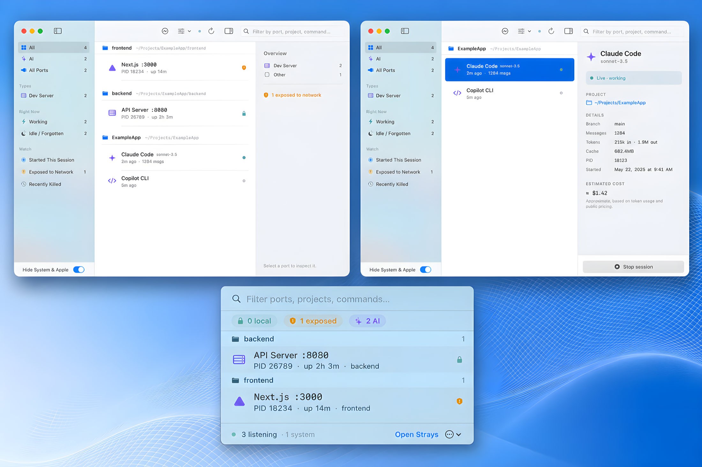

<div align="center">

# 🔌 Strays

**Find the strays — every port and AI session your Mac left running.**

A native macOS menu-bar + window app that shows every listening TCP port,
grouped by the project folder it came from, and lets you kill strays safely.
Local-only, read-only, zero dependencies.



<sub>The window (ports grouped by project) · an AI-session inspector · the menu-bar popover</sub>

</div>

## Why

You run a few dev servers. Your AI agent (Claude Code, Codex, …) spins up a few
more. A week later you've got a dozen `node`, `uvicorn`, and `postgres`
processes listening on ports you can't account for — some idle for days, one
quietly bound to `0.0.0.0`. Strays shows you **what's running, which project it
came from, and whether it's safe to stop** — at a glance.

## Install

```bash
brew install --cask mayur-25-cd/tap/strays
```

Or grab the notarized `.dmg` from [Releases](https://github.com/mayur-25-cd/strays/releases)
and drag Strays to Applications.

## What it does

- **Every listening TCP port, grouped by project folder.** The `uvicorn :8000`
  your agent started shows up under `myapp/api` — "where did this come
  from?" answered with zero effort.
- **Knows what each one is** — detects Vite, Next.js, webpack, Node, uvicorn,
  gunicorn, Flask, Postgres, Redis, MySQL, Docker, and more, each with a
  category glyph.
- **Exposure awareness** — a calm teal lock for `localhost`-only ports, an amber
  shield for anything on `0.0.0.0` / your LAN. Red is reserved *only* for kill.
- **Safe kills** — one click gracefully stops an ordinary dev server (SIGTERM)
  with a 4-second **Undo** (the signal isn't sent until the window elapses, so
  Undo is honest). Databases, exposed ports, and force-kills need a named
  confirmation. System processes can't be killed by mistake — hollow ring,
  disabled button.
- **Idle / forgotten detection** — servers up past a threshold with no active
  connections are flagged *idle*, with a one-click batch reap.
- **Free a Port** (⌘L) — type `:3000`, see who's holding it, stop it.
- **CPU, memory & live connections** per process, in the inspector.
- **Menu-bar popover** — glance at everything, filter, kill, without opening the
  window. Menu-bar-only mode hides the Dock icon entirely.

### The AI-session bonus

Strays also surfaces the **AI coding sessions** running on your Mac — beside the
ports, because that's usually what spawned them:

- **Live sessions grouped by project**, with their project's ports nested
  underneath. Shows model, message count, and last activity.
- **No phantoms** — a session is shown only if its recorded process-start time
  matches the real one, so a recycled PID can never fake a live session.
- **Estimated cost (Claude)** from an incremental transcript tail (byte-offset
  deltas — never a full re-read), clearly labelled an estimate.
- **Read-only & local** — session files are read locally to derive counts and
  metadata only; nothing is stored or sent anywhere.

Everything AI lives under one **AI** filter in the sidebar (⌘2). Just want
ports? **All Ports** (⌘3). Everything? **All** (⌘1).

## Build from source

Requires Xcode 16 / Swift 6 on macOS 14+.

```bash
# double-clickable app bundle in dist/ (defaults to release; pass `debug` for a debug build)
./scripts/build-app.sh
open dist/Strays.app

# or run in debug
swift run
```

## How it works

Cheap subprocess calls per refresh, parsed in machine-readable mode — no
elevated privileges, no daemon:

| Data | Command |
| --- | --- |
| Listening sockets | `lsof -nP -iTCP -sTCP:LISTEN -FpcLtPn` |
| Working directory (batched) | `lsof -a -p <pids> -d cwd -Fpn` |
| Command + start time (batched) | `ps -ww -o pid=,%cpu=,rss=,lstart=,command= -p <pids>` |
| Connections (all, one call) | `lsof -nP -iTCP -sTCP:ESTABLISHED -Fn` |
| AI sessions | reads `~/.claude/sessions`, `~/.copilot/ide`, transcripts |

Kills use the `kill(2)` syscall directly (SIGTERM / SIGKILL), with `EPERM`
surfaced as "requires admin" rather than failing silently.

### Architecture

- `Services/` — `PortScanner`, `AISessionScanner`, `ProcessClassifier`,
  `ProcessKiller`, `ConnectionResolver`, `CommandRunner`.
- `Models/` — `PortEntry` (one row = one PID+port) and `AISession`.
- `State/PortStore.swift` — `@MainActor @Observable` view model: poll loop,
  filtering/grouping, and the kill coordinator (deferred-kill Undo,
  terminating→force escalation, confirmations).
- `Views/` — menu-bar popover, `NavigationSplitView` main window, inspector.

## Privacy

Strays is **read-only and local-only**. It reads other tools' session files on
your machine to derive counts and metadata (message count, model, token usage);
it never stores or transmits their contents. No network, no telemetry, no
daemon. Today it reads only dotfiles (`~/.claude`, `~/.copilot`), which need no
special permission; future adapters that read `~/Library/Application Support`
(e.g. VS Code, Cursor) may prompt for Full Disk Access.

## Notes

- **Not sandboxed / not on the Mac App Store.** Shelling out to `lsof`/`ps` is
  incompatible with the App Sandbox — Strays is distributed as a notarized
  direct download and Homebrew cask.

## Trademarks

Strays is an independent, unaffiliated project. It is not affiliated with,
endorsed by, or sponsored by Anthropic, GitHub/Microsoft, Google, Anysphere, or
any other vendor whose tools it detects. All product names and brands are the
property of their respective owners and are used solely for identification.

## Contributing

Contributions welcome — especially new tool adapters. See
[CONTRIBUTING.md](CONTRIBUTING.md) and [SECURITY.md](SECURITY.md).

## Changelog

See [CHANGELOG.md](CHANGELOG.md) for release history.

## License

[MIT](LICENSE) © 2026 Mayur Parthivaraju.
